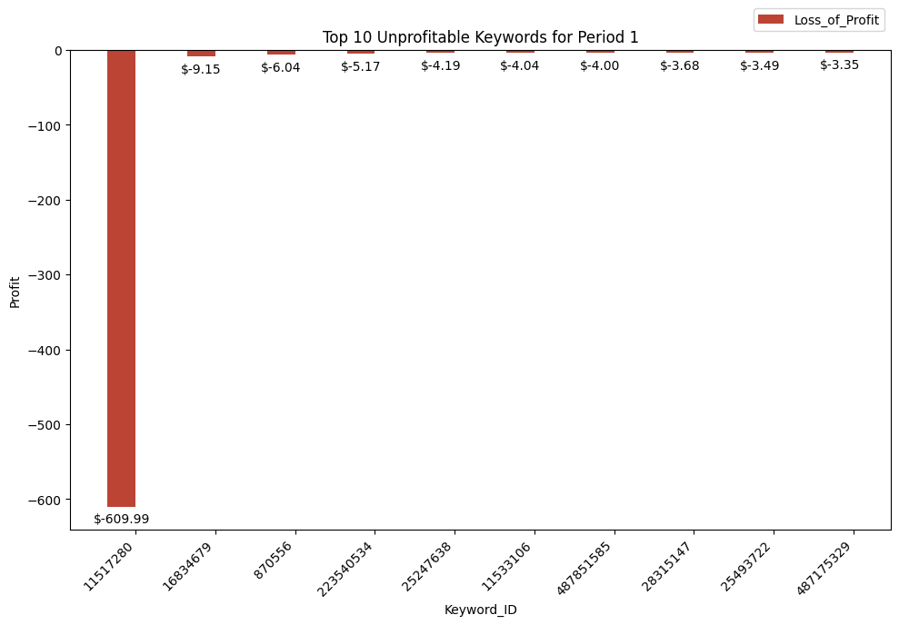
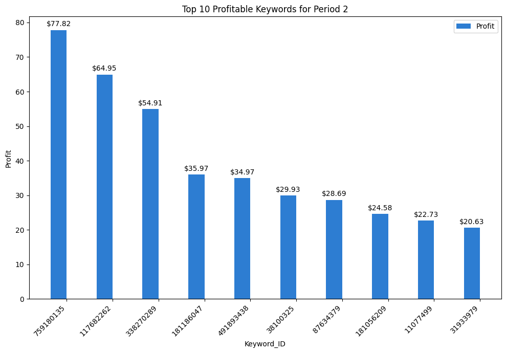
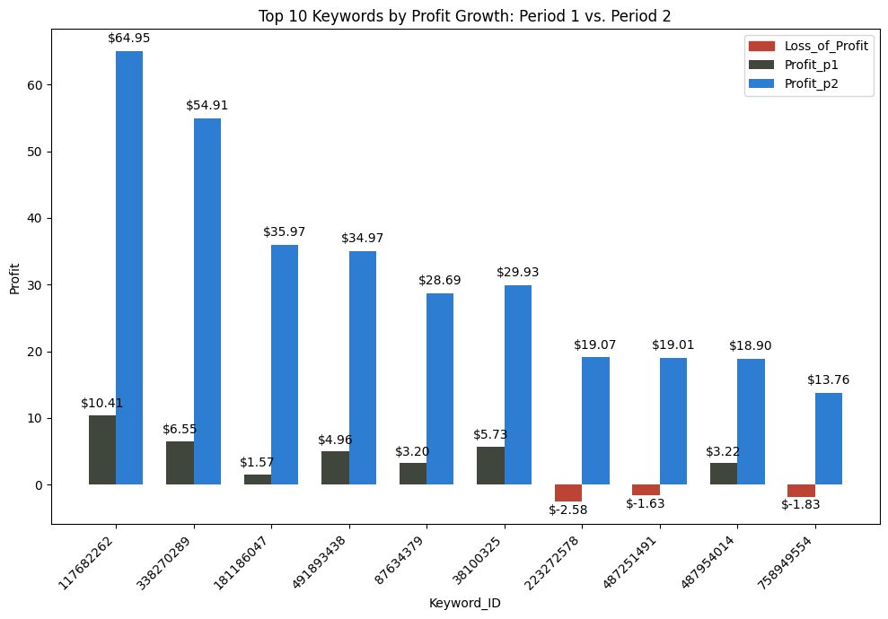

# Keyword Dataset Analysis: Weekly Comparison Across Two Periods

### Data Cleaning
I used Python to clean the data, ensuring correct data types and checking for any anomalies. Below are the data types for each column.

| Period_1_Columns      | Data Type |
|-----------------------|-----------|
| Keyword Tracking ID   | int64     |
| Impressions           | int64     |
| Clicks                | int64     |
| Redirects             | int64     |
| Revenue               | float64   |
| Cost                  | float64   |
| Average Rank          | float64   |

| Period_2_Columns      | Data Type |
|-----------------------|-----------|
| Keyword Tracking ID   | int64     |
| Impressions           | int64     |
| Clicks                | int64     |
| Redirects             | int64     |
| Revenue               | float64   |
| Cost                  | float64   |
| Average Rank          | float64   |

When aggregating the data, some rows for the metrics below contained Null or NaN(Not a Number):  
 1. CPC
 2. Profit_Margins
 3. RR
 4. RPR
 5. RPC

I've chosen to keep the NaN values as opposed to replacing them with 0's to show that the calculation wasn't able to perform due to a missing value such as if their were no clicks. 
 
With the exception to Profit_Margins, I'd chosen to replace negative values with 0 since we already have an indicator if an keyword is unprofitable from the 'Profit' column that will show a negative value. However, I can also see a possible use case of keeping the negative values if the product we were selling would be subscription-based. 

### Business Task
1. For period 1, summarize the data, using metrics you deem most relevant and telling.

Here is a quick summary for the metrics below(rounded by 2 decimals) for the 1st period:
| Metric            | Period_1   |
|-------------------|------------|
| **Revenue total** | $8,365.66  |
| **Cost total**    | $6,723.43  |
| **Profit total**  | $1,642.23  |
| **Impressions total** | 2,031,117 |
| **Clicks total**  | 24,424     |
| **CTR average**   | 2%         |
| **RR average**    | 89%        |
| **RPR average**   | $0.36      |
| **CPC average**   | $0.22      |
| **RPC average**   | $0.32      |

Below I have chart showing the top 10 keywords based on the column 'Profit'. 

I am seeing an overall net profit with the average RPC higher than the average CPC indicates that clicks are, on average, profitable. Our RR standing at 89% shows great effectiveness in redirecting users towards our landing pages.   

2. Looking at the data from Period 1 in aggregate and at the keyword level, what changes, if any, would you suggest the SEM account manager make?

What stood out to me when reviewing the top 10 unprofitable keywords, as shown in the graph below, is the keyword '11517280'.

This keyword was an outlier, costing $609.99, which far exceeded the others. The average rank for this keyword is 1, indicating that it is both highly competitive and costly. The CTR is 3%, which is 1% better than our overall average, while the redirect rate stands at 45%, meaning that almost half of the clicks result in a redirect. There is significant room for improvement with this keyword, and we should prioritize being more selective about the audience viewing this ad. This approach will not only significantly reduce costs but also allow us to target a more relevant audience effectively. Given that this keyword holds on average a rank 1 position, I think it is still a worthwhile venture to fight for this prime real estate.

3. For period 2, summarize the data, using metrics you deem most relevant and telling. Identify the most significant changes you see. It may help to look at the data in aggregate and at the keyword level. Provide an interpretation of how this group of keywords performed from one week to the next.

Here is a comparison of metrics below(rounded by 2 decimals) comparing the two period: 
| Metric               | Period_1   | Period_2   | Difference   |
|----------------------|------------|------------|--------------|
| **Revenue total**    | $8,365.66  | $10,126.57 | +$1,760.91   |
| **Cost total**       | $6,723.43  | $8,376.60  | +$1,653.17   |
| **Profit total**     | $1,642.23  | $1,749.97  | +$107.74     |
| **Impressions total**| 2,031,117  | 2,323,941  | +292,824     |
| **Clicks total**     | 24,424     | 29,079     | +4,655       |
| **CTR average**      | 2%         | 2%         |  0%          |
| **RR average**       | 89%        | 79%        | -10%         |
| **RPR average**      | $0.36      | $0.43      | +$0.07       |
| **CPC average**      | $0.22      | $0.26      | +$0.04       |
| **RPC average**      | $0.32      | $0.33      | +$0.01       |

We are seeing a overall net profit of $107.74 from the changes and our RPC and RPR is increasing at a faster rate than our CPC.  

Below is the top 10 profitable keywords for period 2.

4. Based on what you see in the data, what change(s) do you think the account manager made? What other changes(tweaks to our website or merchant marketplace) could have affected the data?

I merged the two periods into a single table based on 'Keyword_ID' to directly analyze which keywords were retained and updated. The Venn Diagram below illustrates the relationship between the two datasets. Our merged dataset contained 9,999 rows (excluding the header), confirming that we maintained the exact same keywords from the previous period. 

I filtered the merged dataset for keywords that showed a positive profit, resulting in a total of 1,881 profitable keywords.

The visualization below highlights the top 10 keywords with the most profit growth from this filtered dataset.

We have notably increased our profits from the previous period, even converting some previously unprofitable keywords into strong performers, such as 223272578, 487251391, and 758949554. This demonstrates positive momentum in keyword optimization and alignment with user intent.

The Cost Total increased significantly by $1,653.17, likely due to a broader target audience or a higher ad budget aimed at capturing more impressions. This expansion could also explain the 10% drop in RR as we test new customer segments, with some ads possibly missing the mark on aligning with user intent. Despite the lower RR, our RPR rose by $0.07, indicating improved redirect quality and more efficient spending per conversion. 

*Note their is one keyword that I have elected not to show on the graph above because it was a outlier. I will further explain this outlier in question 6*

5. Do you believe the account manager’s actions were effective? Why or why not?

I would say yes they were effective, we are still seeing a net profit from our marketing campaigns and our marketing metrics averages are getting better. With the exception of CPC and RR that have decreased.

I also believe that that the current set of keywords still holds potential for further improvement. A comparison of revenue and cost for both periods shows a 21.05% growth in revenue against a 24.59% increase in cost. While net profit remains positive, we must carefully manage costs to prevent them from outpacing revenue growth.

6. Based on your answer to #5, what would you advise the account manager to do next?

The outlier I identified earlier exhibited a substantial reduction in cost, as shown in the visual below:

The account manager successfully decreased the cost by $490.25, while also increasing the Redirect Rate (RR) from 45% to 87%. Despite a reduction in both impressions and clicks, the higher RR indicates that users are progressing further along the conversion funnel towards the landing page. This suggests that the recent adjustments are making the ad content more aligned with user intent. I recommend that the account manager continue fine-tuning this keyword to further enhance alignment with user expectations and engagement quality.

Additionally, I suggest a deeper investigation into the keywords: 11539661, 11560760, 759872315, 181797761, and 17740825.

These keywords have shown a negative RR difference from exceeding -1 from the previous period, along with a signigicant drop in profitability. Their average rank has increased, but their seems to be a problem post-click for the user, potentially impeding the users from reaching the landing page. This might be because of a faulty landing page link or a slow loading time. 

